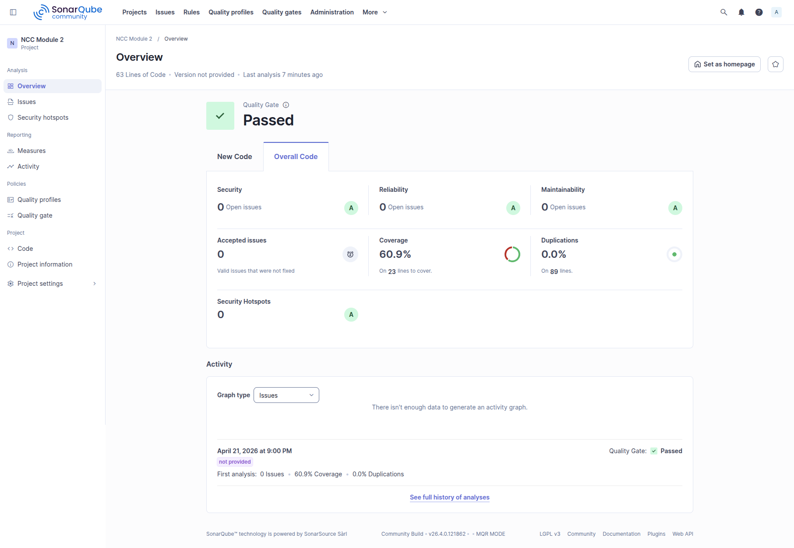

# Laporan Penugasan Modul 2 Open Recruitment NCC 2026

|Nama|NRP|
|---|---|
|Muhammad Quthbi Danish Abqori|5025241036|

### 1. Deskripsi Pipeline yang Dibuat
Arsitektur CI/CD pada proyek ini menggunakan pendekatan **Declarative Pipeline** (*Infrastructure as Code*) yang ditulis di dalam file `Jenkinsfile`. Pipeline dirancang agar berjalan secara otomatis (*Auto-Triggered*) menggunakan integrasi **GitHub Webhook**. 

Fokus utama pipeline ini tidak hanya melakukan integrasi dan *deployment* secara buta, melainkan bertindak sebagai *Quality Assurance* (QA) otomatis. Untuk mengoptimalkan *resource* VPS, tugas dipisah menjadi dua lapisan yaitu Jenkins di OS Host bertugas melakukan pengujian (Unit Test) dan validasi kualitas (SonarQube), sedangkan proses kompilasi (*Build*) dan rilis diserahkan sepenuhnya kepada **Docker (BuildKit)** melalui *multi-stage build* agar berjalan secara terisolasi dan efisien.

### 2. Penjelasan Integrasi Jenkins dengan SonarQube
Integrasi antara Jenkins dan SonarQube diatur menggunakan komunikasi dua arah yang aman dan terstruktur:
* **Autentikasi Aman:** Kredensial (Token) SonarQube tidak di- *hardcode* di dalam *script*, melainkan disimpan dengan aman menggunakan fitur **Jenkins Global Credentials** (`Secret text`). Kredensial ini kemudian diinjeksikan secara dinamis menggunakan blok `withSonarQubeEnv()` di dalam *pipeline*.

* **Eksekusi Analisis:** Jenkins memanfaatkan alat **SonarQube Scanner** yang dikonfigurasi di *Global Tool Configuration* (`SCANNER_HOME`) untuk memindai kode sumber Golang dan membaca file laporan *coverage* (`coverage.out`) hasil dari unit test.

* **Quality Gate (Webhook Feedback):** Integrasi ini dilengkapi dengan *Quality Gate Check*. SonarQube dikonfigurasi untuk mengirimkan *Webhook* konfirmasi kembali ke Jenkins setelah analisis selesai. Jenkins menggunakan fungsi `waitForQualityGate abortPipeline: true` untuk menunda *deployment*. Jika metrik kualitas kode di bawah standar (contoh: *coverage* rendah atau terdapat *security vulnerability*), pipeline akan langsung digagalkan (merah) secara otomatis untuk mencegah kode yang cacat rilis ke server.

### 3. Screenshot Konfigurasi Jenkins dan SonarQube

* **Screenshot Konfigurasi Credentials & Tools Jenkins:**
  
  
* **Screenshot Pengaturan Webhook GitHub:**
  
* **Screenshot Pengaturan Webhook SonarQube:**
  
  

### 4. Screenshot Hasil Analisis Kode di SonarQube

* **Dashboard Hasil Analisis (Passed):**
  

### 5. Penjelasan Alur Pipeline
Berikut adalah rincian eksekusi baris per baris dari `Jenkinsfile` yang telah diimplementasikan:

1. **Persiapan Environment:** Pipeline menetapkan variabel sistem untuk eksekusi, seperti `PATH` untuk Golang, `DOCKER_BUILDKIT = '1'` untuk optimasi Docker, dan mendeklarasikan variabel `GOCACHE` serta `GOMODCACHE` yang mengarah ke direktori *workspace* untuk keperluan *caching dependency* agar waktu *build* lebih efisien. Kredensial dan pengaturan SonarQube juga disiapkan pada blok ini.
2. **Stage: Test and Important Stuff (Parallel Execution):** Untuk mengoptimalkan waktu eksekusi, tahap ini dibelah menjadi dua proses yang berjalan secara bersamaan (*parallel*):
   * **Unit Test:** Menjalankan perintah `go test -v ./...` secara lokal di Jenkins untuk memastikan logika kode berjalan baik, sekaligus menghasilkan file laporan `coverage.out`.
   * **Some Important Stage:** Sebuah *stage* tambahan yang difungsikan sebagai simulasi penanganan tugas lain (seperti *logging* atau notifikasi) untuk memenuhi dan mendemonstrasikan implementasi eksekusi *pipeline* secara paralel (*Parallel Stage Implementation*).
3. **Stage: SonarQube Analysis:** Menjalankan `sonar-scanner` melalui CLI. Laporan *coverage* yang dihasilkan dari tahap sebelumnya dikirimkan ke SonarQube, dengan pengecualian file test (`-Dsonar.exclusions=**/*_test.go`) agar tidak mendistorsi skor kualitas *source code* utama.
4. **Stage: Quality Gate Check:** Pipeline akan berhenti sejenak (maksimal 10 menit) untuk menunggu hasil evaluasi dari SonarQube. Fungsi `waitForQualityGate abortPipeline: true` memastikan bahwa jika metrik kualitas kode tidak memenuhi standar, pipeline akan langsung digagalkan sebelum masuk ke tahap *build*.
5. **Stage: Build Docker Image:** Setelah kode dinyatakan lolos Quality Gate, Jenkins mengeksekusi perintah `docker build` untuk mengemas aplikasi menjadi Docker Image dengan *tag* `ncc-module-2:latest`. Terdapat toleransi kegagalan (`|| true`) pada tahap ini agar eksekusi tetap dilanjutkan jika terjadi kendala minor pada saat *build context*.
6. **Stage: Deploy to VPS:** Melakukan injeksi *environment variable* `PORT=8888` ke dalam file `.env`, kemudian mengeksekusi `docker compose up -d` untuk menjalankan atau memperbarui *container* aplikasi di latar belakang secara otomatis.
7. **Post Actions:** Tahap akhir yang akan memberikan umpan balik (*feedback*) berupa cetakan log di terminal Jenkins. Jika seluruh proses dari awal hingga *deploy* berhasil, sistem akan mencetak pesan sukses; jika ada tahap yang gagal, sistem akan mencetak peringatan kegagalan.

### 6. Kendala yang Dihadapi & Solusi (Troubleshooting)
Dalam proses perancangan *pipeline* *Enterprise-Grade* ini, terdapat beberapa *blocker* teknis yang berhasil diselesaikan:

1. **Error Eksekusi Sonar Scanner (`Unrecognized option: Module`):**
   * **Kendala:** Pipeline gagal pada tahap analisis karena *environment variable* `PROJECT_NAME` ("NCC Module 2") memiliki spasi. Shell Linux menganggap spasi tersebut sebagai argumen CLI baru yang tidak dikenali SonarQube.
   * **Solusi:** Menambahkan tanda kutip ganda secara eksplisit di dalam blok eksekusi shell Jenkinsfile (`-Dsonar.projectName="${PROJECT_NAME}"`).
   
2. **Isu Hak Akses Docker (`permission denied while trying to connect to the docker API`):**
   * **Kendala:** Saat melakukan *deployment*, pipeline gagal karena *user default* Jenkins di VPS Linux tidak memiliki hak akses (*privileges*) untuk mengeksekusi perintah Docker atau membaca file `docker.sock`.
   * **Solusi:** Menambahkan *user* `jenkins` ke dalam *group user* `docker` melalui terminal VPS (`sudo usermod -aG docker jenkins`), lalu melakukan *restart service* Jenkins.
   

