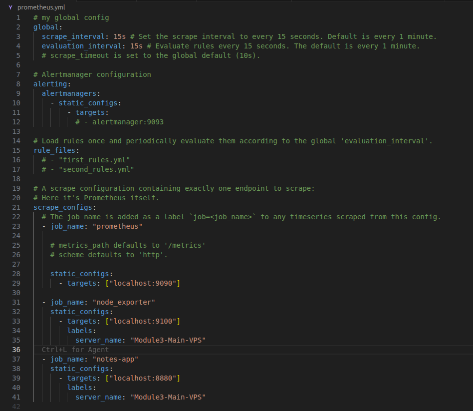
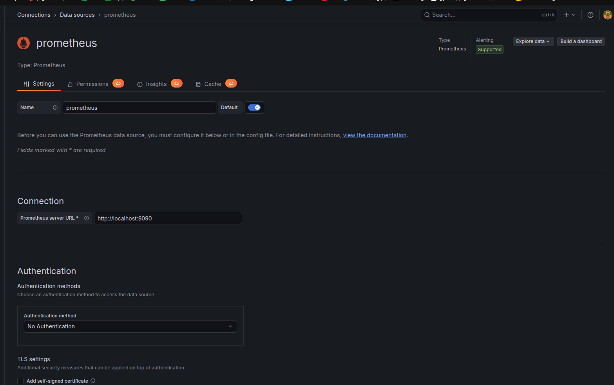
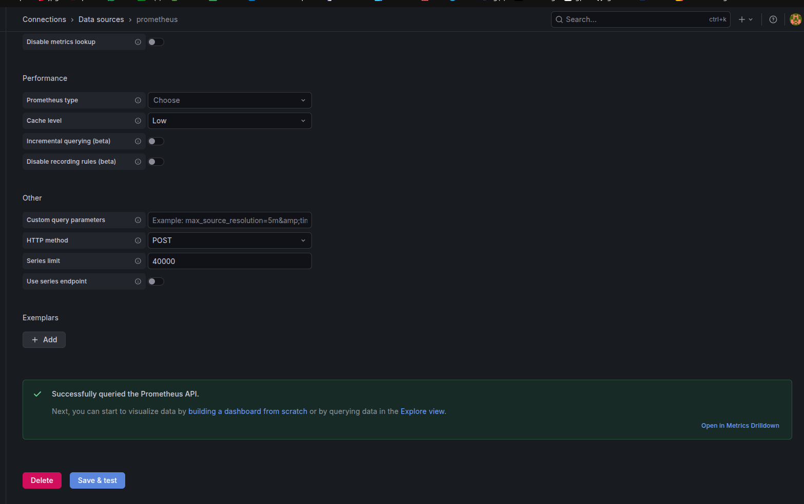
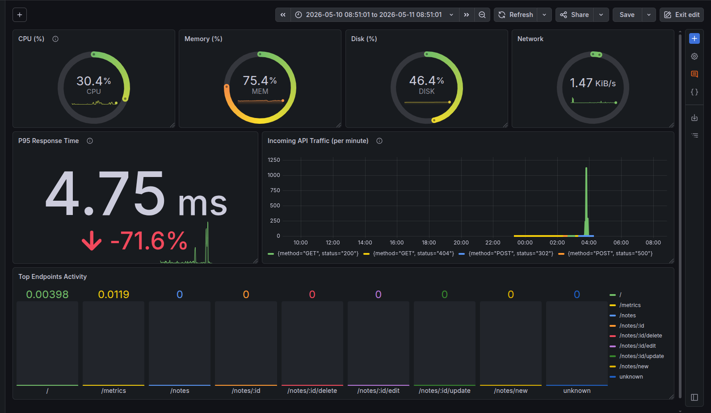

# Laporan Penugasan Modul 3 Open Recruitment NCC 2026

|Nama|NRP|
|---|---|
|Muhammad Quthbi Danish Abqori|5025241036|

## 1. Deskripsi Arsitektur Sistem Monitoring

Berikut adalah cara kerja sistem monitoring dari mengumpulkan data mentah hingga membunyikan alarm di Discord:

### 1. Target Layer (Data Emitters)

Ini adalah lapisan di mana aktivitas fisik dan komputasi terjadi. Target tidak mengirim data sendiri, melainkan "membuka pintu" agar datanya bisa diambil.
* **Node Exporter:** Beroperasi langsung di sistem operasi Ubuntu. Ia bertugas membaca *file* sistem Linux untuk mendapatkan statistik mentah tentang CPU, RAM, Disk, dan Jaringan, lalu mengeksposnya pada *port* `9100`.
* **Notes App (Golang):** Aplikasi yang sudah diinstrumentasi dengan *library* Prometheus. Aplikasi ini menghitung secara mandiri berapa banyak *request* yang masuk dan seberapa cepat ia merespons, lalu memajang angka-angka tersebut di *endpoint* `/metrics` (pada *port* `8880`).

### 2. Collection Layer (Prometheus)

Prometheus bertindak sebagai otak pengepul (*scraper*) dan mesin penyimpanan database.

* **Scraping (Menarik Data):** Sesuai konfigurasi `scrape_interval: 5s` yang dibuat, setiap 5 detik Prometheus secara aktif menghubungi (`HTTP GET`) *port* 9100 dan 8880 untuk "menarik" data metrik terbaru.
* **Time-Series Database (TSDB):** Setelah data ditarik, Prometheus menyimpannya ke dalam basis data khusus yang diurutkan berdasarkan stempel waktu (*time-series*). Di sinilah jutaan titik data itu ditampung.

### 3. Visualization & Alerting Layer (Grafana)

Grafana adalah "wajah" dari sistem ini dan bertugas sebagai pengambil keputusan alarm.

* **Render Visualisasi:** Saat pengguna membuka *dashboard*, Grafana menembakkan kueri bahasa PromQL (seperti `sum(rate(...))`) ke API Prometheus. Prometheus melakukan kalkulasi instan dan mengembalikan hasilnya, yang lalu digambar oleh Grafana menjadi *Gauge* dan *Time Series*.
* **Evaluasi Rule:** Di *background*, mesin Grafana (Alerting Engine) mengeksekusi kueri evaluasi secara rutin (setiap 10 detik di grup *fast-check*). Ia mencocokkan data CPU dan *traffic HTTP* dengan batas kritis yang telah ditentukan (>80% CPU atau >50 RPS).

### 4. Notification Layer (Discord Webhook)

Ini adalah ujung tombak reaksi sistem saat terjadi krisis.

* Jika evaluasi Grafana mendeteksi bahwa batas kritis telah tertembus (dan durasi *Pending* 0 detik telah lewat), status alarm berubah menjadi **Firing**.
* Grafana merakit pesan JSON yang rapi menggunakan *template Go-Template* yang telah dibuat.
* Grafana menembakkan pesan HTTP POST tersebut ke *URL Webhook* Discord. Dalam hitungan milidetik, pesan tersebut mendarat di *channel* Discord sebagai notifikasi peringatan.

## 2. Penjelasan Integrasi Prometheus dengan Grafana

Integrasi dilakukan dengan menjadikan Prometheus sebagai *Data Source* di dalam Grafana. Grafana berkomunikasi dengan Prometheus melalui protokol HTTP API (pada *port* 9090).
Dalam arsitektur ini, Grafana tidak menyimpan data mentah. Ketika pengguna membuka *dashboard* atau sistem *Alerting* mengevaluasi suatu *rule*, Grafana akan mengirimkan kueri PromQL (seperti `sum(rate(...))`) secara *real-time* ke API Prometheus. Prometheus kemudian melakukan komputasi dan mengembalikan hasilnya ke Grafana untuk dirender menjadi komponen visual atau memicu *trigger* alarm.

## 3. Dokumentasi Konfigurasi & Dashboard

**A. Screenshot Konfigurasi Prometheus**

- **Global `scrape_interval`**: Menentukan frekuensi Prometheus mengumpulkan data dari target (dalam contoh ini 5 detik).
- **Alerting**: Konfigurasi untuk mengirim notifikasi ke Alertmanager (tidak digunakan di implementasi ini).
- **Scrape Configs**:
  - `scrape_configs` adalah bagian utama yang mendefinisikan target.
  - **job `golang-app`**: Target untuk Notes App.
    - `static_configs`: Mendefinisikan alamat target (`host.docker.internal:8880`).
    - `labels`: Menambahkan label `application="notes-app"` dan `server_name="main-server"` untuk identifikasi.
  - `job `node-exporter``: Target untuk Node Exporter.
    - `static_configs`: Mendefinisikan alamat target (`host.docker.internal:9100`).
    - `labels`: Menambahkan label `application="node-exporter"` dan `server_name="main-server"`.

**B. Screenshot Konfigurasi Data Source di Grafana**

Tangkapan layar di atas menampilkan antarmuka pengaturan *Data Source* pada Grafana untuk mengintegrasikannya dengan Prometheus. Pada bagian **Connection**, parameter *Prometheus server URL* dikonfigurasi menggunakan `http://localhost:9090`. Konfigurasi ini menginstruksikan Grafana untuk berkomunikasi dan menarik (*pull*) data metrik secara lokal dari *service* API Prometheus yang berjalan pada *port* 9090 di instans yang sama.

**C. Screenshot Custom Dashboard**

Tangkapan layar di atas menampilkan *custom dashboard* pemantauan yang dirancang secara mandiri tanpa menggunakan *template* bawaan. Antarmuka disusun dengan tata letak *modern card-based* untuk memfasilitasi visibilitas data yang cepat dan terstruktur. *Dashboard* ini mengintegrasikan dua kategori metrik utama:
1. **Metrik Infrastruktur OS (via Node Exporter):** Terletak pada baris paling atas yang divisualisasikan menggunakan panel *Gauge* dengan indikator warna batas aman (*threshold*). Panel ini memantau utilisasi CPU (30.4%), Memori/RAM (75.4%), kapasitas Disk (46.4%), serta beban lalu lintas Jaringan (1.47 KiB/s) secara *real-time*.
2. **Metrik Performa Aplikasi (via Golang Instrumentation):** Terletak pada baris tengah dan bawah. Mencakup panel *Stat* yang menghitung *P95 Response Time* (menunjukkan 4.75 ms), grafik *Time Series* yang memetakan lonjakan *Incoming API Traffic* per menit berdasarkan metode dan status HTTP, serta panel *Bar Gauge* untuk mendistribusikan dan mengidentifikasi *endpoint* aplikasi yang paling sering diakses (*Top Endpoints Activity*).

## 4. Penjelasan Alur Monitoring & Alerting

Alur pemantauan dari hulu ke hilir berjalan secara otomatis melalui tahapan berikut:

1. **Generate & Expose:** Aplikasi *Notes* (melalui *middleware* kustom) dan OS Linux mencatat segala aktivitas lalu mengeksposnya ke *endpoint* `/metrics` dalam format *plaintext*.
2. **Scraping:** Setiap 5 detik, server Prometheus menarik (*pull*) data dari *endpoint* tersebut dan menyimpannya ke dalam *database time-series* lokalnya.
3. **Visualization & Rule Evaluation:** Grafana secara periodik menarik data tersebut untuk memperbarui *dashboard*. Di belakang layar, Grafana memproses *Alerting Rules* (misalnya mendeteksi jika lonjakan trafik > 50 RPS saat terjadi simulasi DoS menggunakan *Apache Benchmark*).
4. **Alert Dispatching:** Jika kondisi bahaya terpenuhi (*Firing*), Grafana mengirimkan *payload* berformat JSON ke URL Webhook Discord. Pesan tersebut telah dirapikan menggunakan *Go-Template* sehingga menghasilkan peringatan berlabel merah/hijau yang terstruktur.

## 5. Kendala yang Dihadapi & Resolusi

Selama proses instalasi dan konfigurasi (*deployment*), terdapat beberapa *bottleneck* teknis yang berhasil diselesaikan:

1. **Server Out of Memory (OOM):** Sistem Linux sempat mengalami *freeze* karena beban RAM yang terlalu masif saat menjalankan Jenkins CI/CD, kontainer Java SonarQube, PostgreSQL, dan Prometheus secara bersamaan.
* *Resolusi:* Mengalokasikan 4GB *Swap Memory* virtual di tingkat OS (Ubuntu) sebagai penyangga RAM (*fallback*).

2. **Timeout pada Analisis SonarQube:** Pemindaian kode statis gagal karena SonarQube mencoba menganalisis seluruh pustaka eksternal pihak ketiga (misalnya `golang.org/x/text`) yang tersimpan di dalam *cache* `.mod`.
* *Resolusi:* Menambahkan pengecualian direktori kustom (`-Dsonar.exclusions=/*_test.go,go/,data/`) di dalam langkah `Jenkinsfile`.

3. **Permission Denied pada SQLite Docker:** Aplikasi Golang gagal membuat catatan baru karena *user* di dalam kontainer tidak memiliki hak akses tulis ke direktori *bind mount* bawaan host.
* *Resolusi:* Mengganti tipe penyimpanan dari *Bind Mount* menjadi *Named Volume* di konfigurasi `docker-compose.yml` agar hak akses terkelola otomatis oleh Docker *daemon*.

4. **Duplikasi Data Metrik Linux:** Metrik disk dan memori menampilkan *gauge* kembar di Grafana karena Node Exporter menarik nilai agregat dari partisi virtual Docker (`overlay`/`rootfs`).
* *Resolusi:* Mengimplementasikan modifikasi PromQL spesifik (contoh: `fstype!~"rootfs|overlay"`) dan penggabungan dengan agregator `avg()` untuk mendapatkan *single source of truth*.